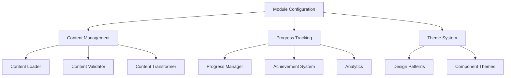

# Module Configuration System Documentation

## Overview

The Module Configuration System provides a comprehensive framework for creating, managing, and scaling education modules within the SoleMD platform. This system enables consistent module development, flexible content management, and standardized user experiences across all education modules.

## Table of Contents

1. [Architecture Overview](#architecture-overview)
2. [Module Configuration](#module-configuration)
3. [Content Management](#content-management)
4. [Progress Tracking](#progress-tracking)
5. [Configuration Examples](#configuration-examples)
6. [API Reference](#api-reference)
7. [Best Practices](#best-practices)
8. [Migration Guide](#migration-guide)

---

## Architecture Overview

The configuration system consists of four main components:



### Core Components

1. **Module Configuration**: Defines module metadata, navigation, and theming
2. **Content Management**: Handles content loading, validation, and transformation
3. **Progress Tracking**: Manages user progress, achievements, and analytics
4. **Theme System**: Provides consistent styling and design patterns

---

## Module Configuration

### Basic Module Configuration

```typescript
import { ModuleConfig } from "./lib/types";

const moduleConfig: ModuleConfig = {
  // Basic Information
  id: "ai-for-md-foundations",
  title: "AI for MD Foundations",
  description:
    "Master the fundamentals of artificial intelligence in healthcare...",
  version: "1.0.0",
  author: "Dr. Jon Sole",

  // Learning Specifications
  estimatedDuration: 180, // minutes
  difficulty: "beginner",
  prerequisites: [
    "Basic understanding of clinical practice",
    "Familiarity with electronic health records",
  ],
  learningOutcomes: [
    "Understand core AI concepts in healthcare",
    "Identify practical AI applications",
    "Navigate ethical considerations",
  ],

  // Navigation Configuration
  navigation: {
    backUrl: "/education/ai-for-md",
    backLabel: "Back to AI for MD",
    breadcrumbs: [
      { label: "Education", href: "/education" },
      { label: "AI for MD", href: "/education/ai-for-md" },
      {
        label: "Foundations",
        href: "/education/ai-for-md/foundations",
        current: true,
      },
    ],
    showProgress: true,
  },

  // Theme Configuration
  theme: {
    primaryColor: "var(--color-fresh-green)",
    accentColor: "var(--color-soft-blue)",
    icon: "BrainCircuit",
    customStyles: {
      badgeBackground: "var(--color-fresh-green)15",
      badgeBorder: "var(--color-fresh-green)30",
    },
  },

  // Status and Timestamps
  status: "published",
  createdAt: new Date("2024-01-15"),
  updatedAt: new Date("2024-02-01"),
};
```

### Using Module Configuration

```typescript
import { ModuleConfigManager } from "./lib/module-config";

// Create configuration manager
const configManager = new ModuleConfigManager(moduleConfig);

// Get module metadata
const metadata = configManager.getMetadata();

// Get navigation configuration
const navConfig = configManager.getNavigationConfig();

// Get theme variables for CSS
const themeVars = configManager.getThemeVariables();

// Generate module statistics
const stats = configManager.generateStats(lessons);
```

---

## Content Management

### Content Configuration Structure

```typescript
import { ContentConfig } from "./lib/module-config";

const contentConfig: ContentConfig = {
  moduleId: "ai-for-md-foundations",
  version: "1.0.0",

  structure: {
    lessons: [
      {
        id: "lesson-1",
        title: "Introduction to AI in Healthcare",
        description: "Overview of AI applications in healthcare",
        duration: 30,
        order: 1,
        contentPath: "/content/lessons/lesson-1.json",
        objectives: [
          "Define AI in healthcare context",
          "Identify current AI applications",
        ],
      },
    ],

    assessments: [
      {
        id: "quiz-1",
        title: "Clinical Decision Support Quiz",
        type: "quiz",
        lessonId: "lesson-3",
        configPath: "/content/assessments/quiz-1.json",
        passingScore: 80,
        maxAttempts: 3,
        timeLimit: 15,
      },
    ],

    resources: [
      {
        id: "resource-1",
        title: "AI in Healthcare Guide",
        type: "pdf",
        url: "/resources/ai-healthcare-guide.pdf",
        downloadable: true,
        lessonIds: ["lesson-1", "lesson-2"],
      },
    ],
  },

  metadata: {
    lastUpdated: new Date(),
    contentHash: "sha256:abc123",
    language: "en-US",
    accessibility: {
      screenReaderSupport: true,
      keyboardNavigation: true,
      highContrast: true,
      captions: true,
    },
  },
};
```

### Content Loading and Management

```typescript
import {
  StaticContentLoader,
  ContentValidator,
  ContentTransformer,
} from "./lib/content";

// Initialize content loader
const contentLoader = new StaticContentLoader();

// Load lesson content
const lesson = await contentLoader.loadLesson("lesson-1");

// Validate content
const validation = ContentValidator.validateLesson(lesson);
if (!validation.valid) {
  console.error("Validation errors:", validation.errors);
}

// Transform legacy content
const modernContent = ContentTransformer.transformLegacyContent(legacyData);

// Make content accessible
const accessibleContent =
  ContentTransformer.makeContentAccessible(contentBlock);
```

### Content Types and Structure

#### Lesson Content Blocks

```typescript
// Text Content Block
{
  id: "block-1",
  type: "text",
  content: {
    html: "<p>Your HTML content here</p>",
    markdown: "Your **markdown** content here"
  },
  order: 1,
  metadata: {
    title: "Introduction",
    required: true,
    estimatedTime: 5
  }
}

// Video Content Block
{
  id: "block-2",
  type: "video",
  content: {
    url: "/videos/lesson-intro.mp4",
    title: "Lesson Introduction",
    duration: 300,
    thumbnail: "/images/video-thumb.jpg"
  },
  order: 2,
  metadata: {
    transcript: "Video transcript here...",
    captions: true,
    accessibility: {
      audioDescriptions: true
    }
  }
}

// Interactive Quiz Block
{
  id: "block-3",
  type: "quiz",
  content: {
    questions: [
      {
        id: "q1",
        type: "multiple-choice",
        question: "What is AI?",
        options: ["Option A", "Option B", "Option C"],
        correctAnswer: "Option B",
        explanation: "Explanation of correct answer",
        points: 10
      }
    ]
  },
  order: 3
}
```

---

## Progress Tracking

### Progress Manager Usage

```typescript
import { ProgressManager, LocalProgressStorage } from "./lib/progress";

// Initialize progress manager
const progressManager = new ProgressManager(new LocalProgressStorage());

// Initialize user progress
const progress = await progressManager.initializeProgress(
  "user-123",
  "ai-for-md-foundations",
  6 // total lessons
);

// Start a lesson
await progressManager.startLesson("lesson-1", 30);

// Update content progress
await progressManager.updateContentProgress("lesson-1", "block-1", 25);

// Complete a lesson
await progressManager.completeLesson("lesson-1", 28);

// Track time spent
await progressManager.trackTimeSpent("lesson-1", 5);

// Record assessment score
await progressManager.recordAssessmentScore("lesson-1", "quiz-1", 85);

// Get progress statistics
const stats = progressManager.getProgressStats(6, 180);
```

### Progress Data Structure

```typescript
interface UserProgress {
  userId: string;
  moduleId: string;
  currentLesson: string;
  completedLessons: string[];
  timeSpent: number;
  lastAccessed: Date;
  completionPercentage: number;
  isCompleted: boolean;
  streak?: number;
  badges?: string[];
  lessonProgress: Record<string, LessonProgress>;
}

interface LessonProgress {
  lessonId: string;
  completed: boolean;
  active: boolean;
  timeSpent: number;
  lastAccessed: Date;
  contentProgress: number;
  completedBlocks: string[];
  assessmentScores?: Record<string, number>;
}
```

### Achievement System

```typescript
import { AchievementSystem } from "./lib/progress";

// Initialize achievement system
const achievements = new AchievementSystem(progressManager);

// Check for new achievements
const newBadges = await achievements.checkAchievements();

// Get badge information
const badgeInfo = achievements.getBadgeInfo("first-lesson");
// Returns: { name: 'Getting Started', description: '...', icon: '🎯' }
```

---

## Configuration Examples

### Creating a New Module

```typescript
import { ConfigurationFactory } from "./lib/module-config";

// Create module template
const newModuleConfig = ConfigurationFactory.createModuleTemplate(
  "advanced-ai-diagnostics",
  "Advanced AI Diagnostics",
  "Deep dive into AI-powered diagnostic tools and techniques"
);

// Customize the configuration
const customConfig = {
  ...newModuleConfig,
  difficulty: "advanced",
  estimatedDuration: 240,
  prerequisites: ["ai-for-md-foundations"],
  theme: {
    primaryColor: "var(--color-soft-blue)",
    icon: "Microscope",
  },
};

// Create content template
const contentTemplate = ConfigurationFactory.createContentTemplate(
  "advanced-ai-diagnostics"
);
```

### Module with Custom Theme

```typescript
const customThemeModule: ModuleConfig = {
  // ... basic config
  theme: {
    primaryColor: "var(--color-warm-coral)",
    accentColor: "var(--color-golden-yellow)",
    icon: "Heart",
    customStyles: {
      badgeBackground: "var(--color-warm-coral)10",
      badgeBorder: "var(--color-warm-coral)25",
      highlightBackground: "var(--color-warm-coral)05",
      cardHoverShadow: "0 8px 32px var(--color-warm-coral)20",
    },
  },
};
```

### Multi-Language Module

```typescript
const multiLanguageContent: ContentConfig = {
  // ... basic config
  metadata: {
    lastUpdated: new Date(),
    contentHash: "sha256:multilang123",
    language: "en-US",
    alternativeLanguages: ["es-ES", "fr-FR", "de-DE"],
    accessibility: {
      screenReaderSupport: true,
      keyboardNavigation: true,
      highContrast: true,
      captions: true,
      translations: true,
    },
  },
};
```

---

## API Reference

### ModuleConfigManager

```typescript
class ModuleConfigManager {
  constructor(config: ModuleConfig);

  // Metadata
  getMetadata(): ModuleMetadata;
  getNavigationConfig(): NavigationConfig;
  getThemeConfig(): ThemeConfig;
  getLearningOutcomes(): string[];
  getPrerequisites(): string[];

  // Navigation
  generateBreadcrumbs(currentPath?: string): BreadcrumbItem[];

  // Theming
  getThemeVariables(): Record<string, string>;

  // Statistics
  generateStats(lessons?: Lesson[]): ModuleStats;
}
```

### ContentConfigManager

```typescript
class ContentConfigManager {
  constructor(contentConfig: ContentConfig);

  // Lesson Management
  getLessonConfig(lessonId: string): LessonConfig | undefined;
  getAllLessons(): LessonConfig[];

  // Assessment Management
  getAssessmentConfig(assessmentId: string): AssessmentConfig | undefined;
  getLessonAssessments(lessonId: string): AssessmentConfig[];

  // Resource Management
  getLessonResources(lessonId: string): ResourceConfig[];

  // Statistics
  getModuleStats(): ModuleStatistics;

  // Validation
  validatePrerequisites(lessonId: string, completedLessons: string[]): boolean;
  getNextLesson(
    currentLessonId: string,
    completedLessons: string[]
  ): LessonConfig | null;
}
```

### ProgressManager

```typescript
class ProgressManager {
  constructor(storage: ProgressStorage);

  // Initialization
  initializeProgress(
    userId: string,
    moduleId: string,
    totalLessons: number
  ): Promise<UserProgress>;
  loadProgress(userId: string, moduleId: string): Promise<UserProgress | null>;

  // Lesson Management
  startLesson(lessonId: string, estimatedDuration?: number): Promise<void>;
  completeLesson(lessonId: string, timeSpent?: number): Promise<void>;

  // Progress Tracking
  updateContentProgress(
    lessonId: string,
    completedBlockId: string,
    progressPercentage: number
  ): Promise<void>;
  trackTimeSpent(lessonId: string, additionalTime: number): Promise<void>;
  recordAssessmentScore(
    lessonId: string,
    assessmentId: string,
    score: number
  ): Promise<void>;

  // Data Access
  getCurrentProgress(): UserProgress | null;
  getProgressStats(
    totalLessons: number,
    estimatedTotalTime: number
  ): ProgressStats;

  // Utilities
  isLessonAccessible(lessonId: string, prerequisites?: string[]): boolean;
  getNextLesson(
    allLessons: Array<{ id: string; prerequisites?: string[] }>
  ): string | null;

  // Listeners
  addProgressListener(listener: (progress: UserProgress) => void): void;
  removeProgressListener(listener: (progress: UserProgress) => void): void;

  // Data Management
  resetProgress(): Promise<void>;
  exportProgress(): string;
  importProgress(progressData: string): Promise<void>;
}
```

---

## Best Practices

### 1. Module Configuration

```typescript
// ✅ Good: Comprehensive configuration
const goodConfig: ModuleConfig = {
  id: "unique-module-id",
  title: "Clear, Descriptive Title",
  description: "Detailed description explaining what learners will gain",
  version: "1.0.0",
  author: "Author Name",
  estimatedDuration: 120,
  difficulty: "beginner",
  prerequisites: ["prerequisite-module-id"],
  learningOutcomes: [
    "Specific, measurable learning outcome",
    "Another clear objective",
  ],
  // ... complete configuration
};

// ❌ Bad: Incomplete configuration
const badConfig = {
  id: "module",
  title: "Module",
  // Missing essential fields
};
```

### 2. Content Organization

```typescript
// ✅ Good: Logical content structure
const lessons = [
  {
    id: "lesson-1-intro",
    title: "Introduction to Topic",
    order: 1,
    prerequisites: [],
  },
  {
    id: "lesson-2-basics",
    title: "Basic Concepts",
    order: 2,
    prerequisites: ["lesson-1-intro"],
  },
  {
    id: "lesson-3-advanced",
    title: "Advanced Applications",
    order: 3,
    prerequisites: ["lesson-2-basics"],
  },
];

// ❌ Bad: Unclear dependencies
const badLessons = [
  { id: "advanced", prerequisites: ["basic"] },
  { id: "basic", prerequisites: [] },
  { id: "intro", prerequisites: ["advanced"] }, // Circular dependency!
];
```

### 3. Progress Tracking

```typescript
// ✅ Good: Proper error handling and validation
try {
  await progressManager.startLesson(lessonId, estimatedDuration);

  // Track meaningful interactions
  await progressManager.updateContentProgress(lessonId, blockId, 25);

  // Complete with actual time spent
  await progressManager.completeLesson(lessonId, actualTimeSpent);
} catch (error) {
  console.error("Progress tracking error:", error);
  // Handle error appropriately
}

// ❌ Bad: No error handling
progressManager.startLesson(lessonId); // May fail silently
progressManager.completeLesson(lessonId, 0); // No time tracking
```

### 4. Content Validation

```typescript
// ✅ Good: Always validate content
const validation = ContentValidator.validateLesson(lesson);
if (!validation.valid) {
  console.error("Content validation failed:", validation.errors);
  // Handle validation errors
  return;
}

// Proceed with valid content
await contentLoader.loadLesson(lesson.id);

// ❌ Bad: Skip validation
await contentLoader.loadLesson(lesson.id); // May load invalid content
```

### 5. Theme Consistency

```typescript
// ✅ Good: Use CSS variables for theme consistency
const themeConfig = {
  primaryColor: "var(--color-fresh-green)",
  accentColor: "var(--color-soft-blue)",
  customStyles: {
    badgeBackground: "var(--color-fresh-green)15",
    badgeBorder: "var(--color-fresh-green)30",
  },
};

// ❌ Bad: Hard-coded colors
const badTheme = {
  primaryColor: "#aedc93", // Won't adapt to theme changes
  accentColor: "#a8c5e9",
};
```

---

## Migration Guide

### Migrating from Legacy Webapp

1. **Analyze Existing Structure**

   ```typescript
   // Use content transformer to analyze legacy content
   const legacyContent = await loadLegacyWebapp();
   const analysis = ContentTransformer.analyzeLegacyStructure(legacyContent);
   ```

2. **Create Module Configuration**

   ```typescript
   const moduleConfig = ConfigurationFactory.createModuleTemplate(
     "legacy-module-id",
     "Migrated Module Title",
     "Description from legacy webapp"
   );
   ```

3. **Transform Content**

   ```typescript
   const transformedContent =
     ContentTransformer.transformLegacyContent(legacyContent);
   const validatedContent = transformedContent.map((block) =>
     ContentTransformer.makeContentAccessible(block)
   );
   ```

4. **Migrate Progress Data**
   ```typescript
   const legacyProgress = await loadLegacyProgress();
   const modernProgress =
     ProgressTransformer.migrateLegacyProgress(legacyProgress);
   await progressManager.importProgress(JSON.stringify(modernProgress));
   ```

### Updating Existing Modules

1. **Version Management**

   ```typescript
   // Update module version
   const updatedConfig = {
     ...existingConfig,
     version: "1.1.0",
     updatedAt: new Date(),
   };
   ```

2. **Content Updates**

   ```typescript
   // Validate updated content
   const validation = ContentValidator.validateLesson(updatedLesson);
   if (validation.valid) {
     await contentManager.updateLesson(updatedLesson);
   }
   ```

3. **Progress Migration**
   ```typescript
   // Migrate existing progress to new structure
   const existingProgress = await progressManager.loadProgress(
     userId,
     moduleId
   );
   if (existingProgress) {
     const migratedProgress = migrateProgressStructure(existingProgress);
     await progressManager.importProgress(JSON.stringify(migratedProgress));
   }
   ```

---

## Conclusion

The Module Configuration System provides a robust foundation for creating scalable, maintainable education modules within the SoleMD platform. By following the patterns and best practices outlined in this documentation, developers can create consistent, high-quality learning experiences that integrate seamlessly with the platform's design system and user experience.

Key benefits of this system:

- **Consistency**: Standardized patterns ensure uniform user experience
- **Scalability**: Easy to add new modules and content types
- **Maintainability**: Clear separation of concerns and modular architecture
- **Accessibility**: Built-in accessibility features and validation
- **Analytics**: Comprehensive progress tracking and learning analytics
- **Flexibility**: Configurable themes, content types, and assessment methods

For additional support or questions about the configuration system, refer to the main SoleMD documentation or contact the development team.
