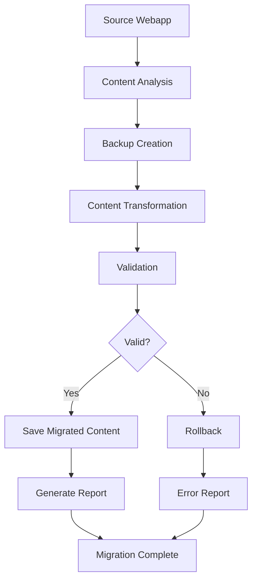

# AI for MD Webapp Migration Process Guide

## Overview

This guide provides comprehensive instructions for migrating the existing AI for MD webapp content to the new SoleMD education module format. The migration process includes automated content transformation, validation, backup, and rollback capabilities.

## Migration Architecture

### Process Flow



### Key Components

- **Migration Orchestrator**: Coordinates the entire migration process
- **Content Transformer**: Converts webapp content to module format
- **Validation System**: Ensures content integrity and quality
- **Backup System**: Creates backups and enables rollback
- **Reporting System**: Generates detailed migration reports

## Prerequisites

### System Requirements

- Node.js 18+ with TypeScript support
- Access to source webapp directory (`temp-ai-for-mds/`)
- Write permissions for target directory
- Sufficient disk space for backups (2x source content size)

### Dependencies

```bash
npm install --save-dev @types/node
```

### Environment Setup

```typescript
// Set up environment variables
process.env.MIGRATION_BACKUP_DIR = "./migration-backups";
process.env.MIGRATION_LOG_LEVEL = "info";
```

## Step-by-Step Migration Process

### Step 1: Pre-Migration Analysis

#### Analyze Source Content

```typescript
import { MigrationOrchestrator } from "./lib/migration-utilities";

const orchestrator = new MigrationOrchestrator();

// Analyze source content structure
const sourceDirectory = "./temp-ai-for-mds";
const analysis = await orchestrator.analyzeSourceContent(sourceDirectory);

console.log("Source Analysis:", analysis);
```

#### Verify Source Integrity

```typescript
import { MigrationIntegrityChecker } from "./lib/migration-utilities";

const integrityChecker = new MigrationIntegrityChecker();
const sourceContent = await loadSourceContent(sourceDirectory);
const integrityCheck = await integrityChecker.verifySourceIntegrity(
  sourceContent
);

if (!integrityCheck.isValid) {
  console.error("Source content integrity issues:", integrityCheck.issues);
  // Address issues before proceeding
}
```

### Step 2: Configure Migration

#### Basic Configuration

```typescript
import { createDefaultTransformationConfig } from "./lib/content-transformation";

const migrationConfig = {
  ...createDefaultTransformationConfig(),
  validation: {
    validateSource: true,
    validateTarget: true,
    strict: false, // Set to true for production
    customValidators: [],
  },
};
```

#### Module Metadata

```typescript
const moduleMetadata = {
  id: "ai-for-md-foundations",
  title: "AI for MD Foundations",
  description:
    "Interactive guide for clinicians to develop AI skills for research, analysis, and discovery",
  version: "1.0.0",
  author: "Dr. Jon Sole",
  difficulty: "intermediate" as const,
  prerequisites: [],
  learningOutcomes: [
    "Understand core LLM concepts and mechanics",
    "Master precision prompting techniques",
    "Apply S.A.F.E.R. framework for clinical AI use",
    "Integrate AI tools into clinical workflows",
  ],
};
```

### Step 3: Execute Migration

#### Run Migration

```typescript
import { executeMigration } from "./lib/migration-utilities";

const sourceDirectory = "./temp-ai-for-mds";
const targetDirectory = "./app/education/ai-for-md/foundations/data";

const migrationResult = await executeMigration(
  sourceDirectory,
  targetDirectory,
  moduleMetadata
);

console.log("Migration Result:", migrationResult);
```

#### Handle Migration Results

```typescript
if (migrationResult.success) {
  console.log("✅ Migration completed successfully");
  console.log("Statistics:", migrationResult.statistics);

  if (migrationResult.warnings) {
    console.warn("⚠️ Warnings:", migrationResult.warnings);
  }
} else {
  console.error("❌ Migration failed");
  console.error("Errors:", migrationResult.errors);

  // Consider rollback
  const rollbackSuccess = await orchestrator.rollbackMigration(migrationId);
  console.log("Rollback:", rollbackSuccess ? "Success" : "Failed");
}
```

### Step 4: Validation and Quality Assurance

#### Validate Migration Result

```typescript
import { validateMigrationResult } from "./lib/migration-utilities";

const originalContent = await loadSourceContent(sourceDirectory);
const validationResult = await validateMigrationResult(
  originalContent,
  migrationResult
);

console.log("Validation Report:");
console.log(validationResult.report);

if (!validationResult.isValid) {
  console.error("Migration validation failed - consider rollback");
}
```

#### Content Quality Checks

```typescript
import { contentValidator } from "./lib/content-validation";

if (migrationResult.content) {
  // Validate module structure
  const moduleValidation = contentValidator.validateModule(
    migrationResult.content
  );

  // Validate individual lessons
  for (const lesson of migrationResult.content.lessons) {
    const lessonValidation = contentValidator.validateLesson(lesson);
    if (!lessonValidation.isValid) {
      console.warn(
        `Lesson ${lesson.id} validation issues:`,
        lessonValidation.errors
      );
    }
  }
}
```

### Step 5: Post-Migration Tasks

#### Generate Documentation

```typescript
// Migration report is automatically generated
const reportPath = `./migration-backups/${migrationId}/migration-report.md`;
console.log(`Migration report available at: ${reportPath}`);
```

#### Update Integration Points

```typescript
// Update module configuration for SoleMD integration
const moduleConfig = {
  ...migrationResult.content?.configuration,
  integration: {
    platformTheme: true,
    platformLayout: true,
    analytics: true,
    authentication: false,
  },
};
```

## Migration Scenarios

### Scenario 1: Full Migration

Complete migration of all webapp content to new module format.

```typescript
const fullMigrationConfig = {
  sourceFormat: "json" as const,
  targetFormat: "react" as const,
  rules: [
    {
      id: "foundations-components",
      sourcePattern: /foundations\//,
      targetTransform: "interactive-demo",
      priority: 1,
    },
    {
      id: "assessment-content",
      sourcePattern: /\.data\.json$/,
      targetTransform: "assessment",
      priority: 2,
    },
  ],
  validation: {
    validateSource: true,
    validateTarget: true,
    strict: true,
  },
};
```

### Scenario 2: Incremental Migration

Migrate content in phases, starting with core components.

```typescript
const incrementalMigrationConfig = {
  ...fullMigrationConfig,
  rules: [
    {
      id: "phase-1-foundations",
      sourcePattern: /foundations\/(temperature|model-size|tokenizer)/,
      targetTransform: "interactive-demo",
      priority: 1,
      conditions: [{ type: "exists", field: "initializers", value: true }],
    },
  ],
};
```

### Scenario 3: Content-Only Migration

Migrate content without interactive elements for initial testing.

```typescript
const contentOnlyConfig = {
  ...fullMigrationConfig,
  rules: [
    {
      id: "text-content-only",
      sourcePattern: /\.html$/,
      targetTransform: "rich-text",
      priority: 1,
    },
  ],
};
```

## Error Handling and Troubleshooting

### Common Migration Issues

#### Issue 1: Source Content Not Found

```typescript
// Error: Source directory or files not accessible
// Solution: Verify paths and permissions
const sourceExists = await fs
  .access(sourceDirectory)
  .then(() => true)
  .catch(() => false);
if (!sourceExists) {
  throw new Error(`Source directory not found: ${sourceDirectory}`);
}
```

#### Issue 2: Content Validation Failures

```typescript
// Error: Migrated content fails validation
// Solution: Review validation errors and adjust transformation rules
if (!migrationResult.success && migrationResult.errors) {
  const validationErrors = migrationResult.errors.filter(
    (e) => e.type === "validation"
  );
  console.log("Validation errors to address:", validationErrors);
}
```

#### Issue 3: Interactive Component Transformation

```typescript
// Error: Interactive components not properly transformed
// Solution: Verify component mapping and initializer functions
const interactiveComponents = [
  "temperature",
  "prompt-builder",
  "safer-framework",
];
for (const component of interactiveComponents) {
  // Verify component data exists
  if (!sourceData[component]) {
    console.warn(`Missing data for interactive component: ${component}`);
  }
}
```

### Debugging Migration Issues

#### Enable Detailed Logging

```typescript
const debugConfig = {
  ...migrationConfig,
  debug: true,
  logLevel: "verbose",
};
```

#### Inspect Intermediate Results

```typescript
// Add breakpoints in transformation process
const transformer = new ContentTransformer(migrationConfig);
transformer.on("componentTransformed", (component, result) => {
  console.log(`Transformed ${component.id}:`, result);
});
```

#### Validate Individual Components

```typescript
// Test transformation of individual components
const testComponent = sourceContent.components.find(
  (c) => c.id === "temperature"
);
const transformedComponent = await transformer.transformComponent(
  testComponent
);
console.log("Individual transformation result:", transformedComponent);
```

## Rollback Procedures

### Automatic Rollback

```typescript
// Rollback is automatically triggered on critical failures
if (migrationResult.errors?.some((e) => e.severity === "error")) {
  const rollbackResult = await orchestrator.rollbackMigration(migrationId);
  console.log("Automatic rollback:", rollbackResult ? "Success" : "Failed");
}
```

### Manual Rollback

```typescript
// Manual rollback when needed
const migrationId = "migration_2024-01-15T10-30-00-000Z_abc123def";
const rollbackSuccess = await orchestrator.rollbackMigration(migrationId);

if (rollbackSuccess) {
  console.log("✅ Rollback completed successfully");
} else {
  console.error("❌ Rollback failed - manual intervention required");
}
```

### Backup Management

```typescript
// List available backups
const backups = orchestrator.listBackups();
console.log("Available backups:", backups);

// Clean up old backups (older than 7 days)
orchestrator.cleanupBackups(7);
```

## Performance Optimization

### Large Content Migration

```typescript
// For large content sets, use streaming migration
const streamingConfig = {
  ...migrationConfig,
  streaming: true,
  batchSize: 10, // Process 10 components at a time
  concurrency: 3, // Max 3 concurrent transformations
};
```

### Memory Management

```typescript
// Monitor memory usage during migration
const memoryUsage = process.memoryUsage();
console.log("Memory usage:", {
  rss: Math.round(memoryUsage.rss / 1024 / 1024) + "MB",
  heapUsed: Math.round(memoryUsage.heapUsed / 1024 / 1024) + "MB",
});
```

### Progress Tracking

```typescript
// Track migration progress
orchestrator.on("progress", (progress) => {
  console.log(
    `Migration progress: ${progress.completed}/${progress.total} (${progress.percentage}%)`
  );
});
```

## Quality Assurance Checklist

### Pre-Migration Checklist

- [ ] Source content analysis completed
- [ ] Source integrity verified
- [ ] Migration configuration reviewed
- [ ] Target directory prepared
- [ ] Backup space available
- [ ] Dependencies installed

### Post-Migration Checklist

- [ ] Migration completed successfully
- [ ] Content validation passed
- [ ] Interactive elements functional
- [ ] Educational objectives preserved
- [ ] Accessibility compliance verified
- [ ] Performance benchmarks met
- [ ] Integration tests passed
- [ ] Documentation updated

### Content Quality Checklist

- [ ] All original content preserved
- [ ] Interactive demos working
- [ ] Assessments functional
- [ ] Learning objectives clear
- [ ] Takeaway messages included
- [ ] Navigation working properly
- [ ] Visual consistency maintained
- [ ] Mobile responsiveness verified

## Maintenance and Updates

### Regular Maintenance Tasks

```typescript
// Weekly backup cleanup
setInterval(() => {
  orchestrator.cleanupBackups(7);
}, 7 * 24 * 60 * 60 * 1000); // Weekly

// Monthly integrity checks
setInterval(async () => {
  const integrityCheck = await integrityChecker.verifyMigrationIntegrity(
    originalContent,
    currentContent
  );
  if (!integrityCheck.isValid) {
    console.warn("Content integrity issues detected:", integrityCheck.issues);
  }
}, 30 * 24 * 60 * 60 * 1000); // Monthly
```

### Content Updates

```typescript
// Update migrated content when source changes
const updateConfig = {
  ...migrationConfig,
  incrementalUpdate: true,
  compareTimestamps: true,
};

const updateResult = await orchestrator.updateMigratedContent(
  sourceDirectory,
  targetDirectory,
  updateConfig
);
```

### Version Management

```typescript
// Track content versions
const versionInfo = {
  sourceVersion: "1.0.0",
  migrationVersion: "1.0.0",
  targetVersion: "1.0.0",
  migrationDate: new Date().toISOString(),
};

await fs.writeFile(
  path.join(targetDirectory, "version.json"),
  JSON.stringify(versionInfo, null, 2)
);
```

## Best Practices

### Migration Planning

1. **Analyze First**: Always analyze source content before migration
2. **Test Incrementally**: Start with small subsets of content
3. **Validate Continuously**: Validate at each step of the process
4. **Backup Everything**: Create backups before any changes
5. **Document Changes**: Keep detailed logs of all modifications

### Content Preservation

1. **Educational Value**: Ensure learning objectives are preserved
2. **Interactive Elements**: Verify all interactions work correctly
3. **Assessment Accuracy**: Validate quiz questions and answers
4. **Clinical Context**: Maintain medical accuracy and context
5. **User Experience**: Preserve intuitive navigation and flow

### Error Prevention

1. **Dry Run**: Always perform a dry run before actual migration
2. **Validation Rules**: Implement comprehensive validation
3. **Rollback Plan**: Have rollback procedures ready
4. **Monitoring**: Monitor migration progress and resource usage
5. **Testing**: Test migrated content thoroughly

This comprehensive guide ensures successful migration of the AI for MD webapp content while maintaining educational effectiveness and technical quality.
