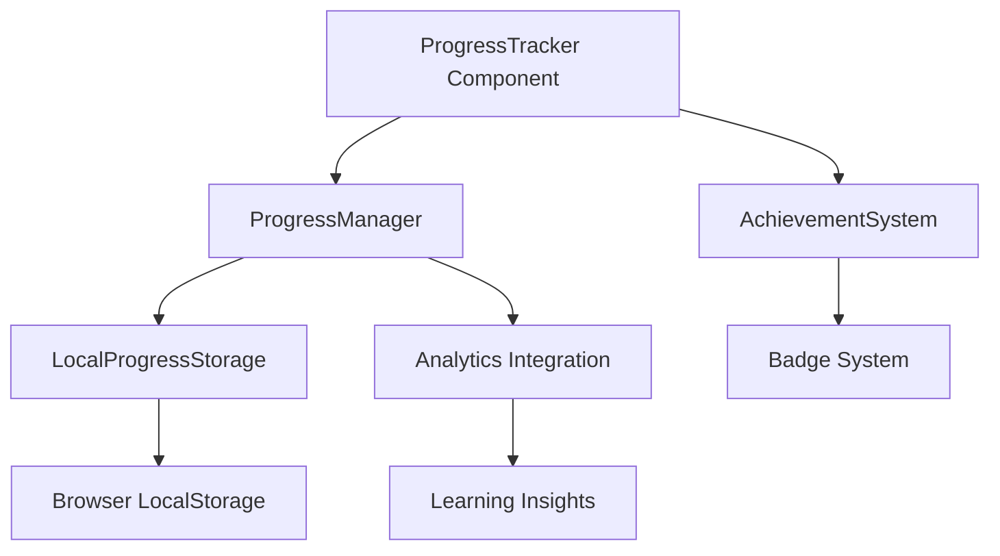

# Progress Tracking Patterns Documentation

## Overview

This document provides comprehensive documentation for the progress tracking system implemented in the AI for MD Foundations module. These patterns are designed to be reusable across all education modules within the SoleMD platform and establish the foundation for learning analytics and user engagement tracking.

## Architecture Overview

The progress tracking system consists of three main components:

1. **ProgressTracker Component** - Visual progress display with analytics integration
2. **ProgressManager Class** - Core progress management and persistence
3. **AchievementSystem Class** - Badge and milestone tracking



## Core Features

### 1. Comprehensive Progress Tracking

The system tracks multiple dimensions of learner progress:

- **Lesson Completion**: Individual lesson progress and completion status
- **Time Tracking**: Session time and total time spent learning
- **Content Progress**: Granular tracking of content block completion
- **Assessment Scores**: Quiz and assessment performance tracking
- **Learning Velocity**: Pace and consistency metrics
- **Engagement Metrics**: Interaction patterns and drop-off points

### 2. Local Storage Persistence

All progress data is automatically persisted to browser localStorage:

```typescript
// Progress is automatically saved on every update
await progressManager.completeLesson(lessonId, timeSpent);
await progressManager.updateContentProgress(lessonId, blockId, percentage);
```

### 3. Analytics Integration Points

The system provides hooks for analytics integration:

```typescript
interface AnalyticsIntegration {
  trackInteraction: (event: InteractionEvent) => void;
  trackMilestone: (milestone: string, data: any) => void;
  trackDifficulty: (lessonId: string, difficulty: string, context: any) => void;
  trackEngagement: (sessionData: any) => void;
}
```

### 4. Achievement System

Automatic badge and milestone tracking:

- **First Lesson**: Completing the first lesson
- **Halfway There**: Reaching 50% completion
- **Module Complete**: Finishing the entire module
- **Dedicated Learner**: Spending significant time learning
- **High Achiever**: Maintaining high assessment scores

## Implementation Guide

### Basic Usage

```typescript
import ProgressTracker from "./components/ProgressTracker";
import { ProgressManager } from "./lib/progress";

function LearningModule() {
  const [progress, setProgress] = useState<EnhancedProgressData>();
  const [progressManager] = useState(() => new ProgressManager());

  useEffect(() => {
    // Initialize progress
    progressManager
      .initializeProgress(userId, moduleId, totalLessons)
      .then(setProgress);
  }, []);

  return (
    <ProgressTracker
      moduleId="ai-for-md-foundations"
      lessonId="current-lesson-id"
      progress={progress}
      onProgressUpdate={setProgress}
      showAnalytics={true}
      showAchievements={true}
    />
  );
}
```

### Advanced Configuration

```typescript
// With analytics integration
const analyticsIntegration: AnalyticsIntegration = {
  trackInteraction: (event) => {
    // Send to analytics service
    analytics.track("learning_interaction", event);
  },
  trackMilestone: (milestone, data) => {
    // Track achievement milestones
    analytics.track("learning_milestone", { milestone, ...data });
  },
  trackDifficulty: (lessonId, difficulty, context) => {
    // Track learning difficulties
    analytics.track("learning_difficulty", { lessonId, difficulty, context });
  },
  trackEngagement: (sessionData) => {
    // Track engagement metrics
    analytics.track("learning_engagement", sessionData);
  },
};

// With accessibility options
const accessibilityOptions = {
  announceProgress: true,
  highContrast: false,
  reducedMotion: false,
};

<ProgressTracker
  moduleId="ai-for-md-foundations"
  lessonId="current-lesson-id"
  progress={progress}
  onProgressUpdate={setProgress}
  analytics={analyticsIntegration}
  accessibility={accessibilityOptions}
  customStyles={{ borderRadius: "12px" }}
/>;
```

## Data Models

### UserProgress Interface

```typescript
interface UserProgress {
  userId: string;
  moduleId: string;
  currentLesson: string;
  completedLessons: string[];
  timeSpent: number;
  lastAccessed: Date;
  completionPercentage: number;
  isCompleted: boolean;
  streak?: number;
  badges?: string[];
  lessonProgress: Record<string, LessonProgress>;
}
```

### Enhanced Progress Data

```typescript
interface EnhancedProgressData extends UserProgress {
  recentActivity: ActivityItem[];
  velocity: {
    lessonsPerWeek: number;
    averageSessionTime: number;
    consistencyScore: number;
  };
  difficultyMetrics: {
    strugglingAreas: string[];
    strongAreas: string[];
    averageAttempts: number;
  };
  engagement: {
    totalInteractions: number;
    averageEngagementTime: number;
    dropOffPoints: string[];
  };
}
```

## Analytics Events

The system automatically tracks the following events:

### Interaction Events

- `session_start` - User begins a learning session
- `lesson_start` - User starts a specific lesson
- `lesson_complete` - User completes a lesson
- `content_view` - User views content block
- `content_interaction` - User interacts with content
- `assessment_start` - User begins an assessment
- `assessment_complete` - User completes an assessment
- `progress_update` - Progress data is updated

### Milestone Events

- `badge_earned` - User earns an achievement badge
- `module_complete` - User completes entire module
- `streak_milestone` - User reaches learning streak milestone
- `time_milestone` - User reaches time-based milestone

### Difficulty Events

- `progress_save_error` - Error saving progress data
- `content_load_error` - Error loading content
- `assessment_failure` - Multiple failed assessment attempts
- `navigation_confusion` - Unusual navigation patterns

## Design System Integration

### Visual Design Patterns

The ProgressTracker component follows SoleMD design system patterns:

```typescript
// Education theme color
const educationColor = "var(--color-fresh-green)";

// Floating card styling
className="floating-card p-6"
style={{
  backgroundColor: "var(--card)",
  borderColor: "var(--border)",
}}

// Typography classes
className="text-card-title"
className="text-body-small"
```

### Animation Patterns

```typescript
// Entrance animation
initial={{ opacity: 0, y: 20 }}
animate={{ opacity: 1, y: 0 }}
transition={{ duration: 0.6, ease: "easeOut" }}

// Progress bar animation
initial={{ width: 0 }}
animate={{ width: `${completionPercentage}%` }}
transition={{ duration: 1, ease: "easeOut" }}
```

### Accessibility Features

- **ARIA Labels**: Proper labeling for screen readers
- **Progress Bar**: Semantic progressbar role with aria-valuenow
- **Live Regions**: Progress announcements for screen readers
- **Keyboard Navigation**: Full keyboard accessibility
- **High Contrast**: Support for high contrast themes
- **Reduced Motion**: Respects prefers-reduced-motion settings

## Performance Considerations

### Local Storage Optimization

- **Efficient Serialization**: JSON serialization with date handling
- **Index Management**: User-level indexes for quick module lookup
- **Error Handling**: Graceful degradation when storage fails
- **Data Cleanup**: Automatic cleanup of old progress data

### Memory Management

- **Timer Cleanup**: Proper cleanup of session timers
- **Event Listeners**: Automatic removal of progress listeners
- **Component Unmounting**: Clean unmounting with effect cleanup

### Bundle Size

- **Tree Shaking**: Only import required icons and utilities
- **Code Splitting**: Lazy loading of achievement system
- **Minimal Dependencies**: Leverages existing SoleMD dependencies

## Testing Patterns

### Unit Testing

```typescript
import { render, screen, waitFor } from "@testing-library/react";
import userEvent from "@testing-library/user-event";
import ProgressTracker from "./ProgressTracker";

describe("ProgressTracker", () => {
  it("should display progress percentage correctly", () => {
    const mockProgress = {
      completedLessons: ["lesson-1", "lesson-2"],
      lessonProgress: {
        "lesson-1": { completed: true },
        "lesson-2": { completed: true },
        "lesson-3": { completed: false },
      },
    };

    render(<ProgressTracker progress={mockProgress} />);

    expect(screen.getByText("67%")).toBeInTheDocument();
  });

  it("should track analytics events", async () => {
    const mockAnalytics = {
      trackInteraction: jest.fn(),
      trackMilestone: jest.fn(),
    };

    render(
      <ProgressTracker progress={mockProgress} analytics={mockAnalytics} />
    );

    await waitFor(() => {
      expect(mockAnalytics.trackInteraction).toHaveBeenCalledWith(
        expect.objectContaining({
          type: "session_start",
        })
      );
    });
  });
});
```

### Integration Testing

```typescript
describe("Progress Integration", () => {
  it("should persist progress to localStorage", async () => {
    const progressManager = new ProgressManager();

    await progressManager.initializeProgress("user-1", "module-1", 5);
    await progressManager.completeLesson("lesson-1", 30);

    const savedProgress = await progressManager.loadProgress(
      "user-1",
      "module-1"
    );

    expect(savedProgress.completedLessons).toContain("lesson-1");
    expect(savedProgress.timeSpent).toBe(30);
  });
});
```

## Migration Guide

### From Basic Progress Tracking

If you have existing basic progress tracking, migrate to the enhanced system:

```typescript
// Old pattern
const [completedLessons, setCompletedLessons] = useState([]);
const [timeSpent, setTimeSpent] = useState(0);

// New pattern
const [progressManager] = useState(() => new ProgressManager());
const [progress, setProgress] = useState<UserProgress>();

useEffect(() => {
  progressManager
    .initializeProgress(userId, moduleId, totalLessons)
    .then(setProgress);
}, []);
```

### Adding Analytics

```typescript
// Add analytics integration
const analytics = {
  trackInteraction: (event) => {
    // Your analytics implementation
    gtag("event", "learning_interaction", event);
  },
  // ... other methods
};

<ProgressTracker analytics={analytics} />;
```

## Best Practices

### 1. Progress Updates

- Update progress immediately after user actions
- Batch multiple updates to avoid excessive saves
- Handle errors gracefully with user feedback

### 2. Analytics Integration

- Track meaningful events, not every interaction
- Include sufficient context for analysis
- Respect user privacy and data protection laws

### 3. Performance

- Use debouncing for frequent updates
- Implement proper cleanup in useEffect
- Monitor localStorage usage and implement cleanup

### 4. Accessibility

- Always include proper ARIA labels
- Test with screen readers
- Support keyboard navigation
- Respect user motion preferences

### 5. Error Handling

- Provide fallbacks when localStorage fails
- Show user-friendly error messages
- Log errors for debugging without exposing sensitive data

## Future Enhancements

### Planned Features

1. **Cloud Sync**: Synchronize progress across devices
2. **Advanced Analytics**: Machine learning insights
3. **Social Features**: Progress sharing and comparison
4. **Adaptive Learning**: Personalized learning paths
5. **Offline Support**: Full offline capability with sync

### Extension Points

The system is designed for easy extension:

- **Custom Storage**: Implement ProgressStorage interface
- **Custom Analytics**: Extend AnalyticsIntegration interface
- **Custom Achievements**: Add new badge types
- **Custom Visualizations**: Create new progress displays

## Troubleshooting

### Common Issues

1. **Progress Not Saving**

   - Check localStorage availability
   - Verify user permissions
   - Check for storage quota limits

2. **Analytics Not Tracking**

   - Verify analytics integration setup
   - Check network connectivity
   - Review event data structure

3. **Performance Issues**
   - Monitor localStorage size
   - Check for memory leaks in timers
   - Review component re-render patterns

### Debug Mode

Enable debug logging:

```typescript
const progressManager = new ProgressManager();
progressManager.enableDebugMode(true);
```

This comprehensive progress tracking system provides a solid foundation for learning analytics while maintaining excellent user experience and accessibility standards.
