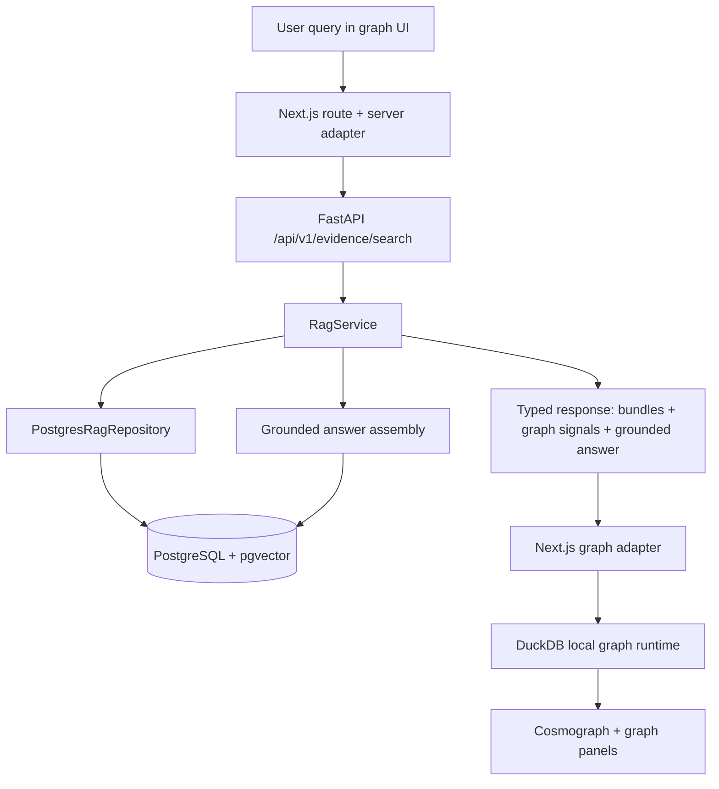
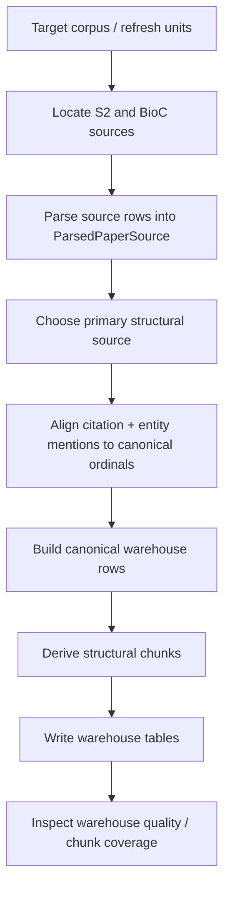
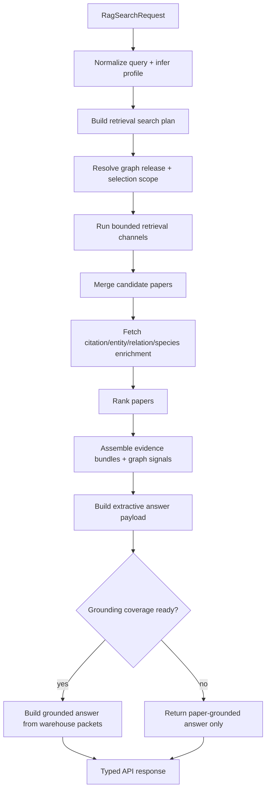

# SoleMD.Graph RAG Architecture

> **Canonical deep-dive**: this is the detailed architecture document for the
> live SoleMD.Graph RAG system as implemented in the repository on
> `2026-04-02`.
>
> **Use this document when you need to understand or recreate the full stack**:
> ingest, normalization, chunking, warehouse contracts, runtime retrieval,
> ranking, answer synthesis, grounding, frontend integration, and evaluation.
>
> **Read this with**:
> - [rag.md](./rag.md) for the shorter high-level map
> - [rag-architecture-code.md](./rag-architecture-code.md) for the code-oriented companion
> - [database.md](./database.md) for schema and migration detail
> - [semantic-scholar.md](./semantic-scholar.md) for the Semantic Scholar side
> - [pubtator3.md](./pubtator3.md) for the PubTator/BioC side

---

## 1. Executive Summary

### State Matrix: Current vs Target

| Capability | Live Default | Live Optional | Planned | Rejected |
| --- | --- | --- | --- | --- |
| Answer Generation | Extractive Baseline | None | Gemini Synthesized | Direct LLM DB Querying |
| Reranking | Lexical/Dense fusion | MedCPT | Evidence-tier / EBM | Always-on LLM-as-a-judge |
| Answer State | Prose + citations | None | Explicit (Supported, Mixed) | Undifferentiated |
| Citation Granularity | Document & chunk | None | Claim-to-span | Document-only |

SoleMD.Graph uses a **paper-first retrieval architecture with chunk-backed
grounding**.

That sentence captures the most important design choice in the entire system:

1. The runtime retrieves and ranks **papers**, not arbitrary chunks, as the
   primary unit of evidence.
2. The warehouse stores a **canonical structural representation** of each paper:
   document -> sections -> blocks -> sentences -> mentions.
3. Chunks are **derived serving rows** built from that canonical structure, not a
   separate source of truth.
4. Answer grounding is **coverage-gated** and assembled from warehouse packets
   anchored to canonical block and sentence ordinals.

The result is a system with clean seams:

- **Ingest** is responsible for turning heterogeneous sources such as S2ORC and
  BioCXML into one stable structural contract.
- **Serving** is responsible for release-scoped retrieval, ranking, answer
  selection, and warehouse-backed grounding.
- **Frontend graph resolution** is responsible for mapping backend evidence back
  onto the local graph runtime without changing backend retrieval semantics.

The architecture is deliberately conservative. It prefers:

- canonical spans over reparsing at runtime
- bounded hybrid retrieval over unconstrained model fan-out
- paper-level ranking with explicit query-shape routing
- optional model-heavy refinement only where it helps enough to justify latency
- evaluation and observability as part of the architecture, not as an afterthought

This document explains the system from first principles and then walks the live
implementation from source ingestion all the way to inline-cited grounded answers.

---

## 2. What The System Is Solving

The RAG system exists to answer biomedical questions against the active graph
release while preserving three constraints:

1. **Speed**: the graph UI cannot tolerate a heavyweight open-ended retrieval
   pipeline on every keystroke or ask action.
2. **Structural grounding**: answers must map back to concrete papers, and when
   coverage exists, to concrete block/sentence spans with inline citations.
3. **Release fidelity**: results must stay tied to the active graph release and
   selected graph context rather than drifting into an unrelated corpus universe.

From those constraints, several architecture choices follow immediately:

- retrieval is release-scoped
- selected-paper context is a first-class input
- the system differentiates title-like, passage-like, and general queries
- the runtime uses a stable PostgreSQL adapter boundary rather than reaching
  directly into arbitrary source formats
- warehouse grounding is packetized and validated

---

## 3. Core Design Principles

### 3.1 Canonical spans before runtime cleverness

The runtime never reparses raw documents in order to build citations or answer
packets. It reads canonical warehouse rows that were produced ahead of time from
normalized parser outputs.

Why:

- reparsing is slow
- reparsing introduces version drift
- reparsing makes it hard to guarantee stable ordinals
- reparsing couples serving correctness to parser implementation details

The canonical structure is:

`paper_documents -> paper_sections -> paper_blocks -> paper_sentences -> mention rows`

Everything else is built on top of that structure.

### 3.2 One primary structural source, optional annotation overlays

The system separates **primary text structure** from **annotation overlays**.

- `S2ORC_V2` is preferred as the primary structural and citation spine when viable
- `BioCXML` contributes entity-rich overlays and can also provide structural text
  when S2ORC is not viable

This is encoded in
[`engine/app/rag/source_selection.py`](../../engine/app/rag/source_selection.py).

Why:

- S2ORC is strong for structure, sentences, and citations
- BioCXML is strong for biomedical entities and offsets
- mixing them without a primary/overlay rule would destroy ordinal stability

### 3.3 Paper retrieval, chunk grounding

The runtime retrieves and ranks papers first, then grounds the answer back onto
chunks, blocks, and sentences.

Why:

- graph integration is fundamentally paper-centric
- paper-level ranking is easier to reconcile with citation graph context,
  publication metadata, and selected-paper semantics
- chunk-first retrieval can improve recall for sentence queries, but if it
  becomes the response spine it complicates graph overlays, result identity, and
  citation expansion

So the system uses chunk retrieval as a **channel**, not as the canonical result unit.

### 3.4 Query-shape-aware routing

The runtime does not treat every query as the same problem.

It distinguishes:

- `title_lookup`
- `passage_lookup`
- `general`

Each profile changes retrieval and ranking behavior.

Why:

- title-like queries benefit from exact/prechecked title anchors
- sentence/passage queries need chunk lexical search and tighter grounding bias
- open-ended topical queries benefit from broader hybrid retrieval

### 3.5 Precision beats fan-out

The system suppresses broader dense and semantic-neighbor expansion when it
already has strong direct support.

Why:

- once a title or passage anchor exists, broad expansion often adds review-paper
  noise, citation neighbor drift, or semantically related but not answer-supporting papers
- latency grows quickly when the runtime opens every lane for every query

This principle appears repeatedly in
[`engine/app/rag/retrieval_policy.py`](../../engine/app/rag/retrieval_policy.py).

### 3.6 Expensive models are bounded, optional, and justified

GPU-backed models are used where they buy enough value:

- `SPECTER2` ad-hoc query encoding for dense paper retrieval
- optional `MedCPT` reranking on a bounded top-N window

Why:

- dense retrieval materially improves recall bridging when lexical anchors are weak
- cross-encoder reranking can improve hard biomedical sentence queries, but only
  if kept bounded and conditional
- the live system should not pay model latency on every request by default

### 3.7 Evaluation is part of the architecture

The runtime ships with explicit evaluation harnesses, benchmark generation, slow
case profiling, and route signatures.

Why:

- biomedical retrieval systems regress silently when routes or corpus coverage change
- correctness and latency both need first-class verification
- grounding must be treated as a measurable contract, not a best-effort extra

---

## 4. System Boundaries

The RAG stack spans browser, web adapter, engine, PostgreSQL, and the local
graph runtime.

The clean boundary is:

- browser/web owns interaction and local graph resolution
- engine owns retrieval, ranking, answer assembly, and grounding
- PostgreSQL owns canonical evidence data and release-scoped retrieval indexes
- DuckDB owns local graph bundle resolution and overlay state

The runtime does **not** ask DuckDB to retrieve evidence. DuckDB resolves graph
objects locally after the engine has already decided which papers matter.

---

## 5. High-Level End-To-End Flow

### 5.1 Offline / ingest path

### 5.2 Online / serving path

---

## 6. Source Systems And Their Roles

### 6.1 Semantic Scholar / S2ORC

Semantic Scholar provides:

- paper metadata
- citations
- SPECTER2 paper embeddings
- TLDRs
- S2ORC structured full text

In the RAG architecture, S2 serves two distinct jobs:

1. **Runtime retrieval substrate**
   - papers
   - embeddings
   - citations
   - references
2. **Warehouse primary text source**
   - S2 abstract bootstrap
   - S2ORC V2 full-text structural parse

The design reason for preferring S2ORC as the primary structural source is that
it supplies a coherent text and citation spine suitable for canonical block and
sentence ordinals.

### 6.2 PubTator3 / BioCXML

PubTator3 provides:

- biomedical entity annotations
- relation signals
- BioCXML text and annotation offsets

In this architecture, BioCXML is primarily an **annotation overlay** and
fallback structural source.

The design reason is simple:

- BioC has stronger biomedical annotation value
- S2ORC is typically a better general structural/citation spine
- combining them as primary peers would create ambiguous canonical ordinals

### 6.3 Graph release metadata

Every runtime request starts by resolving a `graph_release_id` to a concrete
`graph_run_id` and release metadata.

Why:

- evidence must remain tied to the active graph release
- selected graph context only makes sense relative to a concrete graph run
- release-scoped retrieval prevents mismatches between graph UI state and
  evidence results

---

## 7. Canonical Parse Model

The ingest system converts all supported sources into the same normalized parser
contract defined in
[`engine/app/rag/parse_contract.py`](../../engine/app/rag/parse_contract.py).

The central in-memory envelope is
[`ParsedPaperSource`](../../engine/app/rag_ingest/source_parsers.py).

It contains:

- `document`
- `sections`
- `blocks`
- `sentences`
- `references`
- `citations`
- `entities`

This model is the first major architecture seam. Parsers can differ internally,
but after parsing they must agree on the normalized contract.

### 7.1 Source adapters

The important adapters are:

- `parse_s2_paper_abstract()`
  in [`source_parsers.py`](../../engine/app/rag_ingest/source_parsers.py)
  - cheap abstract-only bootstrap
  - used to preload explicit targets quickly
- `parse_s2orc_row()`
  in [`source_parsers.py`](../../engine/app/rag_ingest/source_parsers.py)
  - full structural parse
  - strong for sections, narrative blocks, sentences, references, citations
- `parse_biocxml_document()`
  in [`source_parsers.py`](../../engine/app/rag_ingest/source_parsers.py)
  - annotation-rich parse
  - strong for biomedical entities and BioC offsets

### 7.2 Why a normalized parse contract matters

Without a normalized parse contract, every later stage would have to know about
source-specific XML/JSON quirks. That would leak parser instability into:

- chunking
- alignment
- warehouse writes
- runtime grounding

The normalized contract keeps those downstream stages source-agnostic.

---

## 8. Source Precedence And Grounding Plans

Source precedence is centralized in
[`engine/app/rag/source_selection.py`](../../engine/app/rag/source_selection.py).

The two key constructs are:

- `ParsedSourceStructuralProfile`
- `GroundingSourcePlan`

### 8.1 Primary-source rule

The rule is:

- prefer `S2ORC_V2` if it is structurally viable
- otherwise choose the strongest structural source by fallback ranking

“Viable” means the source has enough structure to support canonical runtime use:

- blocks exist, and
- there are retrieval-default blocks, or a citation/reference spine, or at least sentences

### 8.2 Annotation sources

Any non-primary same-corpus source with warehouse value becomes an annotation source.

That means the plan preserves:

- one canonical structural space
- optional overlays for biomedical enrichment

This is the reason the system can combine S2 structure with BioC entities
without inventing unsafe cross-source ordinals.

### 8.3 Why the system does not use “best of every field”

It may be tempting to say:

- take sections from source A
- sentences from source B
- citations from source C
- entities from source D

That approach would make the system fragile because canonical ordinals would stop
meaning one thing. The current design intentionally avoids that trap.

---

## 9. Alignment Model

After source selection, mention spans must be mapped into the primary source’s
canonical block and sentence space.

This is handled by
[`engine/app/rag/alignment.py`](../../engine/app/rag/alignment.py) and the
alignment helpers in
[`engine/app/rag/source_grounding.py`](../../engine/app/rag/source_grounding.py).

### 9.1 Alignment outcomes

The important statuses are:

- `exact`
- `bounded`
- `source_local_only`

Interpretation:

- `exact`: the mention is safely contained by a canonical sentence
- `bounded`: the mention can be anchored to the canonical block but not safely
  to a specific sentence
- `source_local_only`: the mention cannot be safely mapped into canonical ordinals

### 9.2 Why alignment is strict

The system never invents canonical sentence ordinals when the evidence does not
support them.

That matters because grounded answers depend on exact packet references. A loose
alignment policy would create plausible-looking but false inline citations.

### 9.3 Output of alignment

The aligned warehouse-ready mention rows are:

- `PaperCitationMentionRow`
- `PaperEntityMentionRow`

These are later used both for warehouse persistence and runtime packet assembly.

---

## 10. Chunk Architecture

Chunks are defined in the serving contract, not in the raw parser contract.

The chunk contract lives in
[`engine/app/rag/serving_contract.py`](../../engine/app/rag/serving_contract.py):

- `PaperChunkVersionRecord`
- `PaperChunkRecord`
- `PaperChunkMemberRecord`

### 10.1 Why chunks are derived

Chunks are derived because they are a **serving policy**, not a canonical source fact.

The canonical fact is the structural document.

Chunking policy can change over time:

- token budget
- caption merge policy
- overlap policy
- included block kinds
- retrieval-default filtering
- tokenizer choice

If chunks were the primary source of truth, every chunking-policy revision would
force a redesign of grounding semantics. By making chunks derived, the system can
evolve chunking without losing canonical lineage.

### 10.2 Default chunk policy

The default live policy is built in
[`engine/app/rag_ingest/chunk_policy.py`](../../engine/app/rag_ingest/chunk_policy.py).

Important defaults:

- `chunk_version_key = "default-structural-v1"`
- `target_token_budget = 256`
- `hard_max_tokens = 384`
- `CaptionMergePolicy.STRUCTURAL_CONTEXT`
- `SentenceOverlapPolicy.NONE`
- `retrieval_default_only = True`

Included block kinds are conservative:

- narrative paragraphs
- figure captions
- table captions
- table body text

### 10.3 Chunk assembly strategy

Chunk assembly happens in
[`engine/app/rag_ingest/chunking.py`](../../engine/app/rag_ingest/chunking.py).

The practical strategy is:

- narrative text is chunked with sentence-aware semantics
- weak short fragments are coalesced
- tables are normalized as structured units
- heading/section context can be carried into chunk text
- chunk members preserve exact lineage to blocks and sentences

The design goal is not “maximize number of chunks”. It is:

- preserve retrieval value
- preserve structural lineage
- avoid noisy micro-fragments

---

## 11. Warehouse Data Model

The warehouse is the persistence layer that makes runtime retrieval and
grounding reproducible.

### 11.1 Core table families

| Table family | Purpose |
| --- | --- |
| `paper_documents` | one canonical document row per corpus id |
| `paper_document_sources` | provenance for primary and overlay sources |
| `paper_sections` | hierarchical section structure |
| `paper_blocks` | canonical text blocks |
| `paper_sentences` | canonical sentences |
| `paper_reference_entries` | bibliography/reference spine |
| `paper_citation_mentions` | aligned citation mentions |
| `paper_entity_mentions` | aligned entity mentions |
| `paper_chunk_versions` | chunking policy records |
| `paper_chunks` | derived chunk rows |
| `paper_chunk_members` | exact chunk lineage to blocks/sentences |

These row contracts live in:

- [`rag_schema_contract.py`](../../engine/app/rag/rag_schema_contract.py)
- [`warehouse_contract.py`](../../engine/app/rag/warehouse_contract.py)
- [`serving_contract.py`](../../engine/app/rag/serving_contract.py)

### 11.2 Why the warehouse is not graph-admission-dependent

The warehouse is self-contained. It does not depend on whether a paper is in the
current graph base.

That is a critical design decision.

Why:

- evidence and grounding should exist independently of graph admission
- runtime evaluation should not need graph build mutation to test warehouse coverage
- ingestion and graph layout are related, but not the same subsystem

### 11.3 Referential integrity as a design tool

`RagWarehouseWriteBatch` in
[`engine/app/rag_ingest/write_contract.py`](../../engine/app/rag_ingest/write_contract.py)
validates that row relationships make sense before write execution.

This is one of the cleanest parts of the system because it prevents entire
classes of silent warehouse corruption:

- sentences without blocks
- blocks without sections
- mentions pointing to non-existent ordinals
- chunk members referencing absent chunks

---

## 12. Warehouse Write Path

### 12.1 Build phase

The core builder is
[`build_write_batch_from_grounding_plan()`](../../engine/app/rag_ingest/write_batch_builder.py).

It does the following:

1. takes a `GroundingSourcePlan`
2. materializes canonical document/section/block/sentence/reference rows from the primary source
3. materializes aligned citation/entity rows from the primary plus overlays
4. materializes document-source provenance rows
5. optionally layers structural chunks onto the batch

### 12.2 Orchestration phase

The high-level orchestrator is
[`RagWarehouseWriter`](../../engine/app/rag_ingest/warehouse_writer.py).

It supports:

- single-plan ingest
- grouped bulk ingest
- source-group ingest

The writer is a contract seam, not a SQL detail layer.

### 12.3 Execution phase

The actual persistence layer is
[`PostgresRagWriteRepository`](../../engine/app/rag_ingest/write_repository.py).

It writes stages in dependency order and can explicitly defer chunk stages if the
schema is not ready.

That behavior matters because chunk tables are derived-serving tables and should
not block the entire warehouse from storing canonical source facts.

---

## 13. Ingest Orchestrator And Refresh Flow

The top-level refresh entrypoint is
[`run_rag_refresh()`](../../engine/app/rag_ingest/orchestrator.py).

### 13.1 Responsibilities

The orchestrator is responsible for:

- explicit-target refreshes
- source-driven refreshes
- checkpoint/resume
- source-locator refresh
- source-group routing and flushing
- chunk seeding/backfill
- optional warehouse quality inspection

### 13.2 Why the orchestrator is separate from the writer

The writer knows how to persist a valid plan.

The orchestrator knows:

- what to refresh
- in what order
- with what byte/row budgets
- how to resume safely

Keeping those separate prevents warehouse persistence from being coupled to
campaign logic, sidecar locators, or checkpoint bookkeeping.

### 13.3 Source locator sidecars

`source_locator_refresh.py` manages sidecar source locators that map corpus ids
to source units such as S2 shards or BioC archives.

Why:

- targeted refreshes should not have to rescan whole corpora every time
- sidecar locators decouple “where the raw source lives” from runtime serving
- locator state is operational metadata, not part of the serving contract

---

## 14. Runtime Request Path

### 14.1 Browser and Next.js boundary

The browser asks through the Next.js route
[`app/api/evidence/chat/stream.ts`](../../app/api/evidence/chat/stream.ts).

The request is normalized into the engine transport shape in:

- [`lib/engine/graph-rag.ts`](../../lib/engine/graph-rag.ts)
- [`lib/engine/rag.ts`](../../lib/engine/rag.ts)

Important boundary behavior:

- the browser sends raw query text plus graph selection context
- the browser does **not** compute retrieval profiles, entity enrichment terms,
  or ranking logic
- the browser receives a typed evidence response and then resolves it into local
  graph concepts

### 14.2 FastAPI boundary

The engine entrypoint is:

- `POST /api/v1/evidence/search`
  in [`engine/app/api/rag.py`](../../engine/app/api/rag.py)

The request/response contracts are:

- [`RagSearchRequest`](../../engine/app/rag/schemas.py)
- [`RagSearchResponse`](../../engine/app/rag/schemas.py)

### 14.3 Startup warming

On startup, `lifespan()` in
[`engine/app/main.py`](../../engine/app/main.py):

- warms the dense query encoder
- warms the optional biomedical reranker
- runs a real search-path warm request

Why:

- first-request latency matters
- model/adaptor loading should be shifted to startup where possible
- connection/session path should be exercised before timed evaluation

---

## 15. Runtime Service Boundary

The runtime boundary is `RagService` in
[`engine/app/rag/service.py`](../../engine/app/rag/service.py).

It owns:

- dependency wiring
- warmup
- repository session lifecycle
- execution-phase orchestration
- serialization to API response

### 15.1 Two-phase execution

`execute_search()` in
[`engine/app/rag/search_execution.py`](../../engine/app/rag/search_execution.py)
splits runtime execution into:

1. `retrieve_search_state()`
2. `finalize_search_result()`

This split is extremely important architecturally.

Why:

- retrieval and candidate generation need different instrumentation than final ranking
- it is easier to reason about route selection separately from enrichment and answer synthesis
- evaluation can attribute latency to retrieval vs finalize phases cleanly

---

## 16. Query Normalization And Search Planning

### 16.1 Build query

`build_query()` in
[`engine/app/rag/search_support.py`](../../engine/app/rag/search_support.py)
transforms the API request into `PaperRetrievalQuery`.

It derives:

- normalized query text
- selected graph paper reference
- selection scope
- retrieval profile
- clinical intent
- normalized entity terms
- normalized relation terms
- paper/title similarity behavior
- rerank window

### 16.2 Retrieval profile inference

Profile inference is performed by
`determine_query_retrieval_profile()` in
[`engine/app/rag/query_enrichment.py`](../../engine/app/rag/query_enrichment.py).

The runtime recognizes that not all queries are equally served by the same route.

### 16.3 Clinical intent inference

Clinical intent inference is provided by
`infer_clinical_query_intent()` in
[`engine/app/rag/clinical_priors.py`](../../engine/app/rag/clinical_priors.py).

Current coarse intents are:

- `general`
- `treatment`
- `diagnosis`
- `prognosis`
- `mechanism`

This is not a full classifier. It is a bounded runtime prior system used to
decide whether clinician-facing ranking priors are even relevant.

### 16.4 Retrieval search plan

`build_search_plan()` in
[`engine/app/rag/search_plan.py`](../../engine/app/rag/search_plan.py)
converts the normalized query into a `RetrievalSearchPlan`.

The plan controls:

- whether exact title matches are allowed
- whether chunk lexical is primary
- whether paper lexical fallback should open
- whether citation frontier expansion is allowed
- whether selected context should be preserved
- whether the route should prefer precise grounding
- how much selected-context bonus to apply

The plan is the central policy object for the runtime.

---

## 17. Retrieval Channels

The runtime uses a bounded hybrid retrieval architecture with paper as the spine.

### 17.1 Lexical paper search

Route surface:

- exact title
- selected title
- general paper FTS
- scoped paper FTS

Use cases:

- title-like queries
- broad topical queries
- passage fallback when chunk search is empty or weak

Why it exists:

- lexical precision is still the fastest and most reliable path for strongly anchored queries

### 17.2 Chunk lexical search

Used primarily for `passage_lookup`.

Why it exists:

- sentence/passage queries often need direct textual anchoring that paper-title
  or paper-abstract search cannot provide

Why it is bounded:

- passage queries can explode in surface form space
- the system builds a compact phrase set rather than naive broad n-gram fan-out

### 17.3 Entity seed retrieval

The runtime can resolve entity-like surfaces into normalized entity terms and
then retrieve papers through entity mentions.

Why:

- biomedical questions often contain entity surfaces that are more precise than
  pure lexical bag-of-words matching
- entity resolution improves recall without turning the whole system into a pure
  knowledge graph query engine

### 17.4 Relation seed retrieval

The runtime derives normalized relation terms and uses those for relation-aware recall.

Why:

- some biomedical questions are really relation-shaped questions, not just entity- or keyword-shaped ones

### 17.5 Dense query retrieval

Dense query retrieval uses `SPECTER2` ad-hoc query encoding against stored paper embeddings.

Why:

- lexical search misses semantically relevant papers when terminology diverges
- SPECTER2 is aligned to scientific document space and supports ad-hoc search adapters

Why it is not always on in practice:

- strong direct title anchors do not need it
- selected direct anchors can make it mostly additive noise
- dense retrieval is best used where recall bridging matters

### 17.6 Semantic neighbor expansion

Semantic neighbors are retrieved around the **selected paper** only.

Why:

- this is a context-expansion tool, not a global retrieval lane
- selected-paper neighbor search is useful for “papers like this one” evidence expansion
- global semantic-neighbor expansion would muddle release-aware query intent

### 17.7 Citation context expansion

Citation context is a bounded secondary expansion stage performed after initial candidate recall.

Why:

- citation context is informative once the runtime already has plausible papers
- using citation context as a first-stage recall lane would be expensive and noisy
- additive boost is the right semantics for it

---

## 18. Repository Adapter Pattern

The stable read boundary is `RagRepository` in
[`engine/app/rag/repository.py`](../../engine/app/rag/repository.py).

The concrete implementation is `PostgresRagRepository`, composed from focused mixins:

- `_PaperSearchMixin`
- `_SeedSearchMixin`
- `_EvidenceLookupMixin`
- `_VectorSearchMixin`

This is a clean adapter pattern.

Why it matters:

- serving code depends on stable repository behaviors, not raw SQL layout
- SQL route changes remain local to repository mixins and `queries.py`
- evaluation and profiling can inspect routes without breaking service boundaries

### 18.1 Pinned request session

`search_session()` pins a single connection in a `ContextVar` for the request.

Why:

- request-scoped SQL settings stay consistent
- repeated connection churn is avoided
- profile and trace behavior remain stable for one search

### 18.2 Runtime SQL tuning

The repository can set:

- `SET LOCAL jit = off`
- HNSW session knobs
- exact-vector search session knobs

This is a design decision, not an incidental optimization. Runtime evidence
queries are latency-sensitive enough to warrant request-scoped SQL tuning.

---

## 19. Ranking Architecture

Ranking is implemented in
[`engine/app/rag/ranking.py`](../../engine/app/rag/ranking.py) and
[`engine/app/rag/ranking_support.py`](../../engine/app/rag/ranking_support.py).

### 19.1 Candidate fusion

All retrieval lanes collapse into `PaperEvidenceHit`.

`merge_candidate_papers()` in
[`engine/app/rag/retrieval_fusion.py`](../../engine/app/rag/retrieval_fusion.py)
combines the best signals for each corpus id.

That means:

- one paper can carry lexical, chunk, dense, entity, relation, citation, and semantic signals simultaneously
- the runtime does not keep duplicate paper rows per channel

### 19.2 Channel rankings

`build_channel_rankings()` builds per-channel rank maps used for reciprocal rank fusion.

Why:

- rank position is useful even when raw scores differ across channel types
- RRF gives a stable way to reward agreement across retrieval lanes

### 19.3 Additive features

The ranker also uses additive features such as:

- title similarity
- chunk lexical score
- citation boost
- entity score
- relation score
- dense score
- title anchor score
- passage alignment score
- publication type prior
- evidence quality prior
- clinical prior
- biomedical rerank score
- selected context score

### 19.4 Query-profile-specific ranking

The runtime does not sort every query with the same final key.

- `title_lookup` strongly prefers direct title support
- `passage_lookup` strongly prefers direct passage support and passage alignment
- `general` uses the broadest fused-score balance

Why:

- otherwise title and passage queries would get drowned by semantically nearby
  but not directly answer-supporting papers

### 19.5 Clinical priors

Clinical priors exist to gently bias shortlist ranking for clinician-facing queries.

Signals include:

- publication type
- human vs nonhuman species evidence
- certain study designs for diagnosis/prognosis

Why:

- in clinical contexts, human trials, guidelines, systematic reviews, and
  clinically validated study types often deserve higher priority than purely mechanistic or model-organism papers

These priors are currently bounded and optional rather than globally dominant.

---

## 20. Biomedical Model Roles

## Model-Role Matrix

| Role | Model Assignment | Justification |
| --- | --- | --- |
| Graph Geometry | UMAP (local via DuckDB) | Stable layout generation offline. |
| Paper Dense Retrieval | SPECTER2 | Aligned to scientific document space, ad-hoc search adapters. |
| Passage Retrieval | SPECTER2 (fallback) / Lexical | Sentence queries need lexical exactness. |
| Reranking | MedCPT | Contrastively trained biomedical expert for top-N ranking. |
| Autocomplete | Local DuckDB FTS | Zero-latency browser requirement. |
| Synthesis | Gemini 2.5 Flash | Fast streaming, context window, strong citation instruction-following. |

### 20.1 Dense query encoder

`Specter2AdhocQueryEmbedder` in
[`engine/app/rag/query_embedding.py`](../../engine/app/rag/query_embedding.py)
encodes free-text queries into the paper embedding space.

Important live defaults from
[`engine/app/config.py`](../../engine/app/config.py):

- `rag_dense_query_enabled = true`
- `rag_dense_query_use_gpu = true`
- `rag_dense_query_base_model = "allenai/specter2_base"`
- `rag_dense_query_adapter_name = "allenai/specter2_adhoc_query"`

Why SPECTER2 here:

- the paper store is already SPECTER2-oriented
- SPECTER2 explicitly supports task-format adapters, including ad-hoc search
- scientific document retrieval is the primary runtime use case

### 20.2 Biomedical reranker

`apply_biomedical_rerank()` in
[`engine/app/rag/biomedical_reranking.py`](../../engine/app/rag/biomedical_reranking.py)
applies a bounded reranker over the top-N window.

It uses MedCPT-backed models from
[`engine/app/rag/biomedical_models.py`](../../engine/app/rag/biomedical_models.py).

Important live default:

- `rag_live_biomedical_reranker_enabled = false`

That default is intentional.

Why:

- a cross-encoder or heavy reranker is useful only after retrieval has already
  produced a plausible shortlist
- always-on reranking would spend latency budget on easy queries that do not need it
- the system keeps the capability available for hard biomedical cases and evaluation experiments

### 20.3 GPU usage boundary

GPU-backed model work belongs in the engine runtime/model cache path, not in the
frontend or local DuckDB graph runtime.

That keeps:

- browser state light
- graph interactions deterministic
- heavy model inference centralized where it can be warmed, monitored, and tuned

---

## 21. Evidence Bundles And Graph Signals

After ranking, the runtime assembles paper-centric evidence bundles in
[`engine/app/rag/bundle.py`](../../engine/app/rag/bundle.py).

Each `EvidenceBundle` contains:

- the ranked paper summary
- preview snippet
- matched channels
- rank features
- citation contexts
- entity hits
- relation hits
- references
- assets

### 21.1 Why bundles are paper-centric

Bundles are meant to drive:

- graph detail panels
- evidence inspection
- answer selection
- answer-linked graph highlighting

Those are naturally paper-centric concerns.

### 21.2 Graph signals

The runtime also derives graph-lighting instructions:

- answer evidence/support/refute
- entity match
- relation match
- citation neighbor
- semantic neighbor

These are not the same as evidence bundles. They are compact overlay signals for
the graph runtime.

That separation keeps retrieval detail and graph-lighting semantics decoupled.

---

## 22. Answer Synthesis

The current runtime answer is an **extractive baseline**, not an LLM-generated synthesis.

This happens in
[`engine/app/rag/answer.py`](../../engine/app/rag/answer.py).

### 22.1 What the answer builder does

It selects a small number of evidence bundles and formats a compact answer text.

At the same time it emits:

- `segment_texts`
- `segment_corpus_ids`
- `grounding_corpus_ids`

These are later consumed by the grounding system.

### 22.2 Why answer selection is separate from grounding

This separation is essential.

Ranking decides:

- which papers are most relevant overall

Answer selection decides:

- which subset of those papers should actually support answer text

Grounding decides:

- which packetized spans anchor that answer text

If those were collapsed into one step, the system would be much harder to debug
and much less robust to partial warehouse coverage.

---

## 23. Grounded Answer Architecture

## Clinical Safety Contract

1. **Retracted Papers:** Strictly excluded at the database retrieval level (`exclude_retracted=True`).
2. **Outdated Guidelines:** Support for explicit hard gating to prevent legacy clinical guidance from appearing as truth.
3. **Nonhuman Evidence:** Can be gated explicitly via search plans; explicitly labeled in answer state (`nonhuman-only`).
4. **Insufficient Grounding:** Explicit abstention when claims cannot be traced back to warehouse spans (`insufficient`).
5. **Mixed/Contradictory:** Emits `mixed` answer state rather than smoothing over conflicting evidence.

The grounded answer system exists to attach inline-cited structural evidence to
the extractive answer text.

### 23.1 Runtime gate

`build_grounded_answer_from_runtime()` in
[`engine/app/rag/grounded_runtime.py`](../../engine/app/rag/grounded_runtime.py)
checks runtime readiness before attempting grounded answers.

It verifies:

- required tables exist
- the requested chunk version exists
- requested answer corpus ids have chunk coverage

If the runtime is not ready, the system still returns the paper-grounded answer.

This is a deliberate resilience choice. Grounding should upgrade the answer, not
silently block the whole retrieval response.

### 23.2 Packet classes

Grounding assembly supports three packet classes:

1. citation-backed packets
2. entity-only packets
3. structural fallback packets

Why:

- some papers have citation-backed grounding rows
- some only have entity-backed evidence
- some need structural fallback when packet coverage is incomplete

This multi-lane packet assembly is one of the reasons grounding robustness has
improved materially over time.

### 23.3 Packet and anchor invariants

The served contract in
[`engine/app/rag/serving_contract.py`](../../engine/app/rag/serving_contract.py)
enforces:

- answer segments only reference valid inline anchors
- inline anchors only reference valid cited-span packets

This means inline citations are not formatting sugar. They are validated graph
objects with referential integrity.

---

## 24. Response Contract

The API returns a typed response with these major surfaces:

- `meta`
- `graph_context`
- `query`
- `answer`
- `answer_model`
- `answer_corpus_ids`
- `grounded_answer`
- `evidence_bundles`
- `graph_signals`
- `retrieval_channels`

### 24.1 Important contract semantics

- `answer` may exist without `grounded_answer`
- `answer_corpus_ids` is the paper subset used for answer support
- `grounded_answer.answer_linked_corpus_ids` is the grounded equivalent when packetization succeeds
- `retrieval_channels` expose top channel-specific hits for inspection
- internal debug trace is not part of the public response

---

## 25. Frontend Integration And Local Graph Resolution

The frontend does not blindly render the engine response as if it were already
local graph state.

Instead:

1. Next.js maps the engine payload into graph-facing types in
   [`lib/engine/graph-rag.ts`](../../lib/engine/graph-rag.ts)
2. the graph layer resolves returned corpus ids and paper ids into local graph
   references and overlay semantics
3. the local DuckDB runtime remains the source of truth for graph geometry and
   active canvas state

### 25.1 Why this boundary matters

If the engine were to start emitting frontend-specific graph mutations directly,
the backend would become coupled to the local graph bundle representation.

The current boundary avoids that:

- backend chooses evidence
- frontend/local runtime chooses how to resolve and render it

---

## 26. Observability And Performance Architecture

### 26.1 Runtime trace collector

Internal request instrumentation is provided by
[`RuntimeTraceCollector`](../../engine/app/rag/runtime_trace.py).

It records:

- stage durations
- stage call counts
- candidate counts
- session flags

This instrumentation is intentionally lightweight and request-scoped.

### 26.2 Route signatures

Evaluation derives route signatures from session flags so the team can tell which
retrieval strategy actually served a case.

Why:

- correctness alone is not enough
- route drift is one of the easiest ways to regress performance or relevance

### 26.3 Slow-case plan profiling

Slow cases can be profiled with planner-only SQL profiles in
[`engine/app/rag/runtime_profile.py`](../../engine/app/rag/runtime_profile.py).

Captured artifacts include:

- route name
- SQL fingerprint
- plan hash
- node types
- index names

This allows route and plan regressions to be diagnosed without instrumenting
user-facing traffic directly.

### 26.4 Performance-sensitive design decisions

Several runtime design choices exist primarily for latency:

- startup warming of models and a real search path
- request-scoped pinned DB sessions
- PostgreSQL JIT disabled for runtime search sessions
- ANN search via pgvector HNSW when graph scope is broad
- exact search fallback when graph scope is small or ANN is unavailable
- bounded reranking window
- suppression of unnecessary dense/neighbor routes when direct anchors exist

---

## 27. Evaluation And Benchmarking

The evaluation system is part of the architecture, not a sidecar script collection.

### 27.1 Population and case generation

The runtime evaluation pipeline in
[`engine/app/rag_ingest/runtime_eval.py`](../../engine/app/rag_ingest/runtime_eval.py)
and
[`engine/app/rag_ingest/runtime_eval_population.py`](../../engine/app/rag_ingest/runtime_eval_population.py)
builds a stratified evaluation population from the live graph release.

The canonical query families are:

- `title_global`
- `title_selected`
- `sentence_global`

### 27.2 What evaluation measures

Per-case evaluation records:

- hit rank
- top corpus ids
- answer presence
- grounded-answer presence
- whether the target appears in answer and grounded answer
- cited span count
- inline citation count
- per-stage timings
- candidate counts
- route signature
- top hits and rank features

### 27.3 Frozen hard benchmarks

Hard benchmark generation in
[`runtime_eval_benchmarks.py`](../../engine/app/rag_ingest/runtime_eval_benchmarks.py)
turns repeated dense-audit failures into stable benchmark cases.

That is a strong design choice because it converts transient misses into durable
regression targets.

---

## 28. Major Design Decisions And Why They Were Made

### 28.1 Why PostgreSQL + pgvector instead of a vector DB first

Because the runtime needs more than vector search.

It needs:

- release-scoped graph joins
- metadata-rich ranking
- citation expansion
- entity/relation lookups
- grounded answer warehouse reads

Those operations naturally live near relational data. pgvector gives dense
search without forcing the whole system into a separate first-stage vector store.

### 28.2 Why paper-first retrieval instead of chunk-only retrieval

Because the graph and the response model are paper-centric.

Chunk retrieval matters, but as a channel and grounding surface. Paper remains
the right result spine for graph overlays, answer-linked papers, references,
assets, and citation context expansion.

### 28.3 Why S2ORC primary and BioC overlay

Because the system needs one stable structural/citation spine and one strong
biomedical annotation source.

S2ORC and BioC solve different problems well. The architecture captures that
instead of pretending one source should do everything.

### 28.4 Why extractive answers first

Because grounded extractive answers are easier to validate, debug, and
incrementally improve.

The current system can already attach inline citations and answer-linked corpus
ids. An LLM synthesis layer can be added later, but only after the evidence and
grounding substrate are stable.

### 28.5 Why coverage-gated grounded answers

Because returning a malformed grounded answer is worse than returning none.

The system therefore returns:

- evidence bundles always
- extractive answer when available
- grounded answer only when the warehouse can support it correctly

### 28.6 Why optional MedCPT reranking instead of always-on reranking

Because not every query needs it.

The runtime should spend expensive model budget where it has the highest expected
return: difficult biomedical sentence or clinician-facing cases with real shortlist ambiguity.

### 28.7 Why evaluation is release-scoped

Because the graph release and warehouse coverage change over time.

A benchmark divorced from the active release would tell only part of the story.

---

## 29. How To Recreate The Pipeline

If someone had to rebuild this system from scratch, the required order is:

### 29.1 Data and source layer

1. load Semantic Scholar paper metadata, citations, and paper embeddings
2. load PubTator entity and relation data
3. make raw S2ORC and BioC sources discoverable for targeted refresh

### 29.2 Canonical parser layer

1. define a normalized parse contract
2. implement source adapters into that contract
3. implement source precedence rules
4. implement strict alignment into canonical ordinals

### 29.3 Warehouse layer

1. persist canonical document/section/block/sentence/reference rows
2. persist aligned citation/entity rows
3. persist chunk version, chunk, and chunk member rows as derived serving tables
4. validate write batches before applying them

### 29.4 Runtime retrieval layer

1. define request/response contracts
2. normalize raw requests into a backend-owned retrieval query
3. infer query profiles and search plans
4. implement bounded hybrid retrieval channels through a repository adapter
5. merge paper candidates and apply profile-specific ranking
6. assemble evidence bundles and graph signals
7. build an extractive answer payload
8. ground that answer from warehouse packets only when coverage is ready

### 29.5 Evaluation layer

1. generate stratified query cases from the live graph release
2. execute them through the same service path as production
3. measure both correctness and latency
4. profile slow SQL plans
5. freeze recurrent hard failures into explicit benchmarks

If those steps are followed in that order, the current architecture can be reproduced.

---

## 30. Important Invariants

These invariants define whether the architecture is being respected.

1. **Runtime never reparses raw source text to build answer grounding.**
2. **Every grounded packet maps to canonical block/sentence ordinals.**
3. **One request resolves one graph release before retrieval begins.**
4. **Selected-paper context is an input to retrieval planning, not a frontend-only hint.**
5. **All retrieval channels collapse to paper ids before final ranking.**
6. **Chunks are derived, lineage-preserving rows, not primary source facts.**
7. **Inline citation anchors and answer segments must be referentially valid.**
8. **Evaluation executes the live service path rather than a separate scoring path.**
9. **Heavy model inference is bounded and optional.**
10. **Frontend graph resolution is downstream of backend evidence retrieval, not the other way around.**

---

## 31. Key Modules By Responsibility

### Ingest and warehouse

- [`engine/app/rag_ingest/orchestrator.py`](../../engine/app/rag_ingest/orchestrator.py)
- [`engine/app/rag_ingest/source_parsers.py`](../../engine/app/rag_ingest/source_parsers.py)
- [`engine/app/rag/source_selection.py`](../../engine/app/rag/source_selection.py)
- [`engine/app/rag/alignment.py`](../../engine/app/rag/alignment.py)
- [`engine/app/rag_ingest/chunk_policy.py`](../../engine/app/rag_ingest/chunk_policy.py)
- [`engine/app/rag_ingest/chunking.py`](../../engine/app/rag_ingest/chunking.py)
- [`engine/app/rag_ingest/write_batch_builder.py`](../../engine/app/rag_ingest/write_batch_builder.py)
- [`engine/app/rag_ingest/warehouse_writer.py`](../../engine/app/rag_ingest/warehouse_writer.py)
- [`engine/app/rag_ingest/write_repository.py`](../../engine/app/rag_ingest/write_repository.py)

### Runtime retrieval and ranking

- [`engine/app/rag/service.py`](../../engine/app/rag/service.py)
- [`engine/app/rag/search_support.py`](../../engine/app/rag/search_support.py)
- [`engine/app/rag/search_execution.py`](../../engine/app/rag/search_execution.py)
- [`engine/app/rag/search_retrieval.py`](../../engine/app/rag/search_retrieval.py)
- [`engine/app/rag/search_finalize.py`](../../engine/app/rag/search_finalize.py)
- [`engine/app/rag/repository.py`](../../engine/app/rag/repository.py)
- [`engine/app/rag/repository_paper_search.py`](../../engine/app/rag/repository_paper_search.py)
- [`engine/app/rag/repository_seed_search.py`](../../engine/app/rag/repository_seed_search.py)
- [`engine/app/rag/repository_vector_search.py`](../../engine/app/rag/repository_vector_search.py)
- [`engine/app/rag/queries.py`](../../engine/app/rag/queries.py)
- [`engine/app/rag/retrieval_policy.py`](../../engine/app/rag/retrieval_policy.py)
- [`engine/app/rag/ranking.py`](../../engine/app/rag/ranking.py)
- [`engine/app/rag/ranking_support.py`](../../engine/app/rag/ranking_support.py)
- [`engine/app/rag/bundle.py`](../../engine/app/rag/bundle.py)
- [`engine/app/rag/answer.py`](../../engine/app/rag/answer.py)

### Grounding and serving contracts

- [`engine/app/rag/serving_contract.py`](../../engine/app/rag/serving_contract.py)
- [`engine/app/rag/warehouse_grounding.py`](../../engine/app/rag/warehouse_grounding.py)
- [`engine/app/rag/grounded_runtime.py`](../../engine/app/rag/grounded_runtime.py)
- [`engine/app/rag/chunk_grounding.py`](../../engine/app/rag/chunk_grounding.py)
- [`engine/app/rag/grounding_packets.py`](../../engine/app/rag/grounding_packets.py)
- [`engine/app/rag/source_grounding.py`](../../engine/app/rag/source_grounding.py)

### Evaluation and profiling

- [`engine/app/rag_ingest/runtime_eval.py`](../../engine/app/rag_ingest/runtime_eval.py)
- [`engine/app/rag_ingest/runtime_eval_execution.py`](../../engine/app/rag_ingest/runtime_eval_execution.py)
- [`engine/app/rag_ingest/runtime_eval_summary.py`](../../engine/app/rag_ingest/runtime_eval_summary.py)
- [`engine/app/rag_ingest/runtime_eval_population.py`](../../engine/app/rag_ingest/runtime_eval_population.py)
- [`engine/app/rag_ingest/runtime_eval_benchmarks.py`](../../engine/app/rag_ingest/runtime_eval_benchmarks.py)
- [`engine/app/rag/runtime_trace.py`](../../engine/app/rag/runtime_trace.py)
- [`engine/app/rag/runtime_profile.py`](../../engine/app/rag/runtime_profile.py)

### Web and graph integration

- [`app/api/evidence/chat/stream.ts`](../../app/api/evidence/chat/stream.ts)
- [`lib/engine/rag.ts`](../../lib/engine/rag.ts)
- [`lib/engine/graph-rag.ts`](../../lib/engine/graph-rag.ts)
- [`features/graph/lib/detail-service.ts`](../../features/graph/lib/detail-service.ts)

---

## 32. External References That Inform The Design

These are not the source of truth for the SoleMD.Graph implementation, but they
help explain why certain choices are reasonable.

- **SPECTER2**: task-format-specific scientific document embeddings and ad-hoc
  search adapters.
  - Ai2 blog: <https://allenai.org/blog/specter2-adapting-scientific-document-embeddings-to-multiple-fields-and-task-formats-c95686c06567>
- **MedCPT**: contrastively trained biomedical retriever/reranker built from
  large-scale PubMed click logs.
  - Paper: <https://arxiv.org/abs/2307.00589>
- **PubTator 3.0**: large-scale biomedical entity and relation annotations used
  here as the annotation substrate.
  - Project deep-dive: [pubtator3.md](./pubtator3.md)
- **LitSense 2.0**: a useful reference point for sentence/passage biomedical
  retrieval design, especially the lexical-first plus bounded semantic rerank pattern.
  - Paper: <https://academic.oup.com/nar/article/53/W1/W361/8133630>

---

## 33. Final Mental Model

If you remember only one mental model, use this one:

> **SoleMD.Graph RAG is a release-scoped paper retrieval system whose runtime is
> backed by a canonical warehouse of blocks, sentences, mentions, and derived
> chunks. S2ORC usually provides the structural spine, BioC usually provides the
> entity overlay, and the runtime only upgrades from paper-grounded answers to
> inline-cited grounded answers when warehouse coverage proves it can do so safely.**

That is the “how” and the “why” of the whole pipeline.

## Appendix: Invariants

1. **Ranking Centralization:** All channel rankings collapse through reciprocal rank fusion in one place.
2. **Single Search-Session Policy:** Pinned PostgreSQL connection with query-profile tuned execution parameters.
3. **One Primary Structural Source:** S2ORC is the canonical structural spine; BioC provides entity overlays.
4. **Coverage-Gated Grounding:** Extractive answers upgrade to grounded answers only if the chunk version and warehouse coverage exist.
5. **One Runtime-Eval Entrypoint:** `run_rag_runtime_evaluation` runs the exact live service code path.
6. **One Benchmark Loader:** Immutable query test cases bound to semantic domains like neuropsychiatry.
7. **One Route-Signature Registry:** Instrumentation flags trace exact retrieval pathways for performance regressions.
